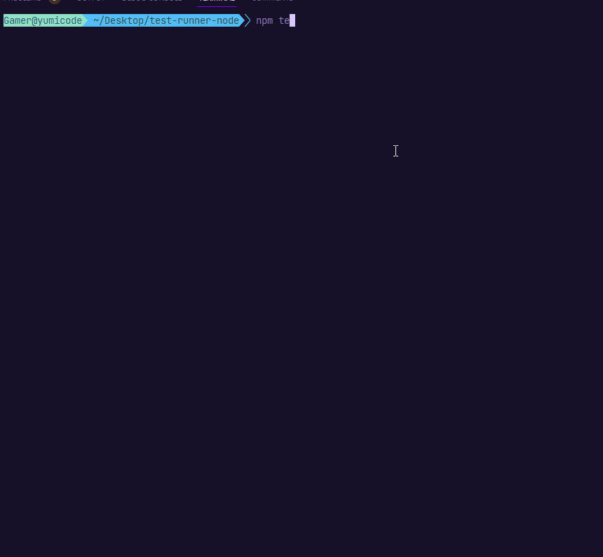
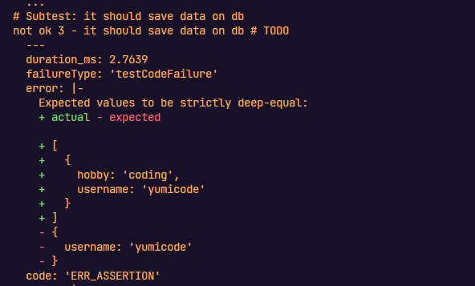
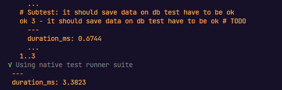
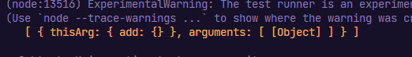
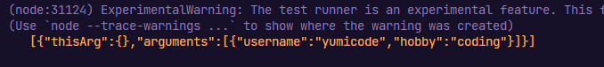
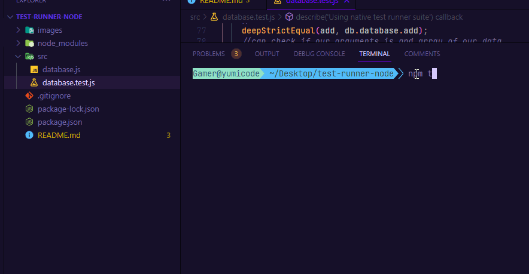

# Node JS native test runner

## Introduction

Simple implementation to test NodeJS native test runner with some notes.

If you want to launch the project

```sh
npm install
```

And if you want to launch the test, just run :

```sh
npm test
```

---

## Creating a new project

- First, create a new project folder

```sh
mkdir test-runner
```

```sh
cd test-runner
mkdir src
cd src
touch database.js
touch database.test.js
cd ..
```

```sh
npm init -y
```

If you want to decorate, install tap-spec module

```sh
npm i -D tap-spec
```

And in package.json

```js
  "scripts": {
    "test": "node --test | tap-spec"
  },
```

And run

```sh
node --test
```

If you want more details

And in package.json

```js
  "scripts": {
    "test": "node src/database.test.js | tap-spec"
  },
```

First, create a simple test if it's working properly :

- Import the modules needed

```js
//~import modules
import { describe, it } from 'node:test';
```

- Then write these test

```js
//~test if it's working properly
it.todo('some test I wanna do in the feature');
it.skip('some test I wanna skip');
```

And run it ! Result :



- Now start the test by creating a fake database and interacting with it

In database.js file :

```js
export default class Database {

    constructor() {
        //Create a new instance of Set object to let us simulate
        this.database = new Set();
    }

    //~Methods
    async create(data){
        // the .add() method will add in the Set object
        return this.database.add(data);
    }

    async read() {
        //return all data from database
        // the .values() method will get all data from the database
        return [...this.database.values()];
    }
}
```

In our test file :

```js
//~import modules
import { describe, it, beforeEach } from 'node:test';
import { deepStrictEqual } from 'node:assert';
import Database from './database.js';


//~tests
describe('Using native test runner suite', () => {
  let db;

  //before each test, reset the instance of db
  beforeEach(() => {
    db = new Database();
  });

  //~test if it's working properly
  it.todo('some test I wanna do in the feature');
  it.skip('some test I wanna skip');  

  //~using our database
  it.todo('it should save data on db', async () => {
    //use the db instance and add data
    await db.create({ username: 'yumicode', hobby: 'coding' });  

    const data = await db.read();

      //test if it's strictly equal
    deepStrictEqual(data, { username: 'yumicode' });
    
  }); //! ERROR ! TESTS FAILS
});
```

Here, the test will fail. Let's see in details :



So, in green what we sent and red, what we expect.

Now, let's do another test and turn it green now

```js
  it.todo('it should save data on db test have to be ok', async () => {
      //use the db instance and add data
    await db.create({ username: 'yumicode', hobby: 'coding' });

    //use read() method from db
    const data = await db.read();
    //test if it's strictly equal
    deepStrictEqual(data, [{ username: 'yumicode', hobby: 'coding' }]);
  }); //! GOOD TEST
```

Result :



## Tracker

The tracker will track your function and see if you receive the correct type

```js
import { deepStrictEqual, CallTracker } from 'node:assert';

const tracker = new CallTracker();

/Now, track our function
    it('tracking calls', async () => {
	    //let's store a spy to track our function
        const spy = tracker.calls();

        //replace our function from db
        // here, everytime we will add something, we will call our spy function
        db.database = {
            add:spy
        }  

        //one method to call data
        const data = [{ username: 'yumicode', id: 4 }]
        await db.create(...data);

        // another method to do it
        // const data = { username: 'yumicode', id: 4 };
        // await db.create(data);

        console.log(tracker.getCalls(spy));
    })
```

Result :

Good, our spy found an object :



Let's now try to stringify it :

```js
  console.log(JSON.stringify(tracker.getCalls(spy)));
```

Result :



Complete tracking :

```js
    //& Track our function => CallTracker from node:assert
    it('tracking calls', async () => {
        const spy = tracker.calls();

        //replace our function from db
        // here, everytime we will add something, we will call our spy function
        db.database = {
            add:spy
        }

        //one method to call data 
        const data = [{ username: 'yumicode', hobby: 'coding' }]
        await db.create([...data]);

        // another method to do it
        // const data = { username: 'yumicode', id: 4 };
        // await db.create(data);
        
        // use stringify to see what we need for our tracker function
        console.log(JSON.stringify(tracker.getCalls(spy)));

        //construct the object now with our tracker
        const [{
            thisArg: { add },
            arguments: fnArgs
        }] = tracker.getCalls(spy);

        //do the assert
        deepStrictEqual(add, db.database.add)
        //can check if our arguments is and array of our data
        deepStrictEqual(fnArgs, [data]);

        // reset the tracker
        tracker.reset();
        deepStrictEqual(tracker.getCalls(spy).length, 0)

        //* deepStrictEqual(WHAT WE HAVE, WHAT WE EXPECT)

    })
```

## Snapshot

We will create a state of the database.
Here NodeJS will create a new file as a new database.

And if you modify the value to test (here if we create a new database => create new instance), it doesn't work because of the state of the snapshot which is the earlier state


```js
  //& Snapshot from node:assert

  it('snapshot', async () => {

    await db.create({ name: 'Fredo' }); //! if we modify this value, it will not equal to the snapshot anymore

    //Result
    const result = await db.read();

    //Will create a snapshot of what we read (new file)
    await snapshot(result, 'dbData');

    //Will create a snapshot formatted
    await snapshot(JSON.stringify(result), 'dbDataFormatted');
``` 



And voilà !


---

Source :

Thank you @Erick, I followed your steps :)
https://www.youtube.com/watch?v=xU1EmrhQCfw&list=LL&index=6&t=230s
